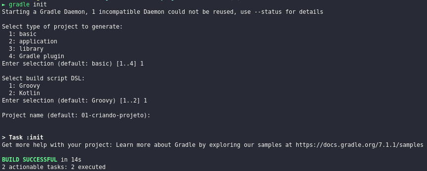
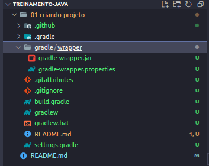
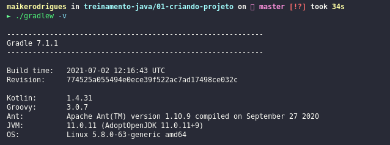

# Criando projeto

## Inicializando projeto com Gradle

Criando wrapper de gradle para definir uma versão de build de projeto.

```bash
gradle init
```

Opções selecionadas do projeto



Criado Warraper do projeto.



Com Warraper criado, você não precisa usar o comando `gradle` global, pode usar o comando dentro do diretório
`./gradlew -v` e para build `./gradlew build`.


