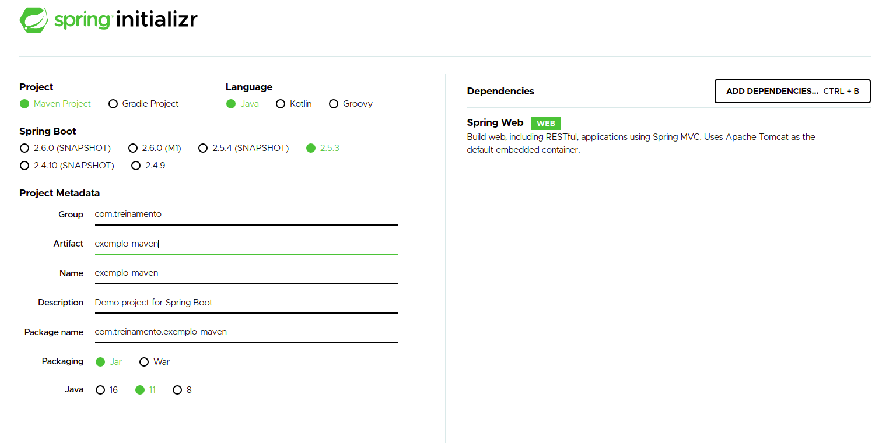
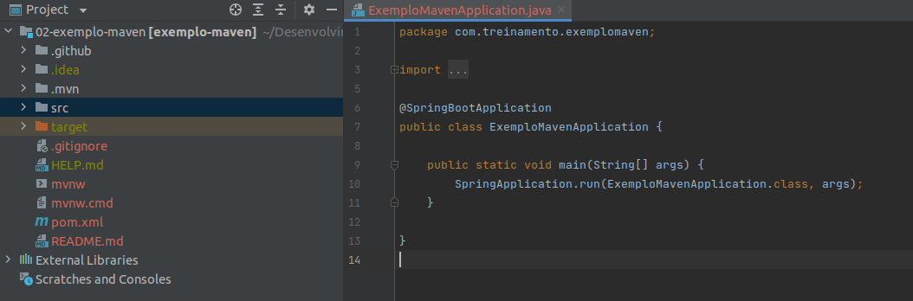
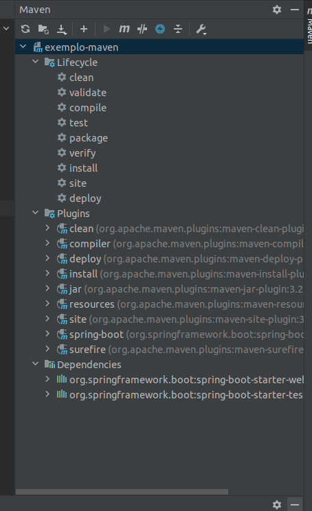
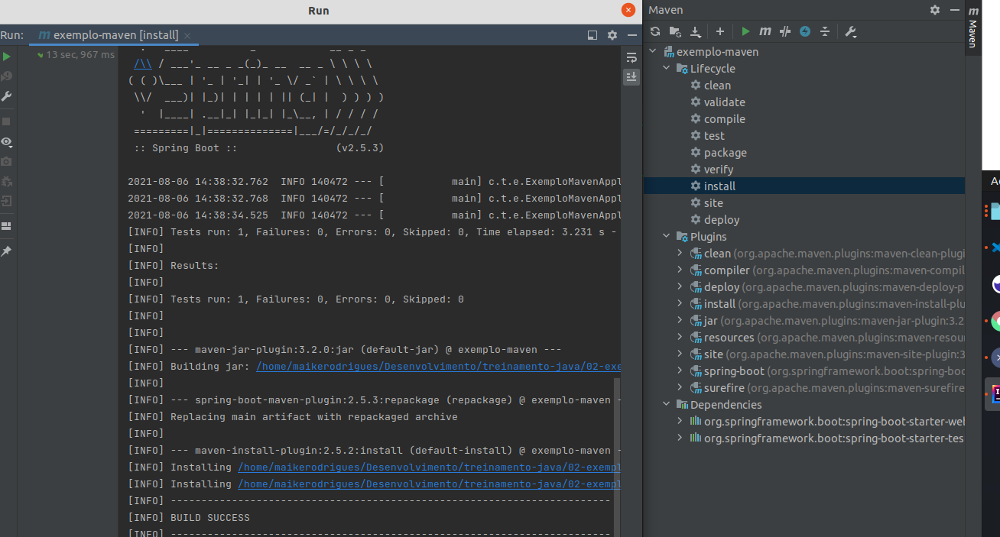
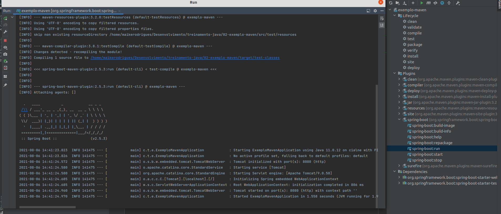
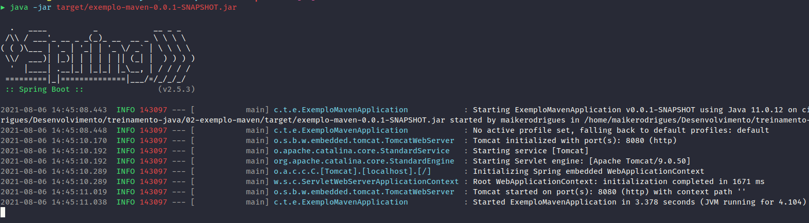

# Criar projeto com Maven

Acesse https://start.spring.io/

Realizar o download do projeto e extrair.

Abrir IntelliJ > Abrir Projeto

Tasks do projeto

Build do JAR: Lifecycle > Installl

Start do JAR: Plugins > spring-boot > spring-boot:run

Ou use `java -jar target/exemplo-maven-0.0.1-SNAPSHOT.jar`

